# Security Design 🛡️

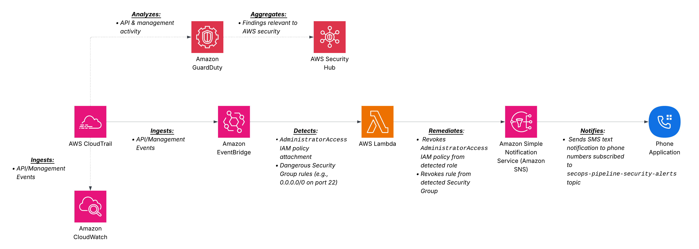

This document details the security controls implemented in the AWS DevSecOps Security Operations project. For a summary, see the [README Security Controls Table](../README.md#security-controls).

---

## Network Security

### VPC Segmentation

The network uses a three-tier subnet architecture across two Availability Zones:

| Tier | Subnets | Contains | Internet Access |
|------|---------|----------|----------------|
| Public | `public-1`, `public-2` | ALB, NAT Gateways | Direct (IGW) |
| Private App | `private-app-1`, `private-app-2` | ECS Fargate tasks | Outbound only (NAT) |
| Private Data | `private-db-1`, `private-db-2` | RDS PostgreSQL | None |

### Security Groups

Security groups enforce layer-to-layer traffic flow:

```
Internet → [ALB SG: 443 inbound] → [ECS SG: app port from ALB SG only] → [RDS SG: 5432 from ECS SG only]
```

| Security Group | Inbound | Outbound |
|---------------|---------|----------|
| ALB | 443 from `0.0.0.0/0` | App port to ECS SG |
| ECS Tasks | App port from ALB SG | 5432 to RDS SG, 443 to internet (NAT) |
| RDS | 5432 from ECS SG | None required |

No security group allows `0.0.0.0/0` on any port other than the ALB's HTTPS listener.

### Routing

- **Internet Gateway** — attached to public subnets only.
- **NAT Gateway** — provides outbound internet for private app subnets (image pulls, API calls).
- **Private data subnets** — no route to the internet in either direction.

---

## Identity & Access Management

### ECS Execution Role

| Role | Purpose | Permissions |
|------|---------|-------------|
| Execution Role | ECS agent pulls images and injects secrets | ECR read, Secrets Manager read (specific ARNs only) |

### Least Privilege Approach

- No `*` resource wildcards on sensitive actions.
- Execution role can only read specific secrets, not all secrets in the account.

---

## Secrets Management

### How Credentials Flow

```
Secrets Manager → ECS Task Definition (valueFrom) → Container environment variable → Application
```

- DB credentials are stored in AWS Secrets Manager, not in Terraform variables, environment files, or code.
- The ECS task definition references secrets by ARN using `valueFrom` — credentials are injected at container startup.
- The execution role has permission to read only the specific secret ARNs needed.
- No secret values appear in Terraform state as plaintext resource attributes.

---

## Transport Security

- **ALB Listener** — HTTPS (443) with ACM-issued TLS certificate.
- **HTTP redirect** — port 80 redirects to 443.
- **ACM validation** — DNS validation via Route 53 (automated in Terraform).

---

## Container Security

- **Non-root user** — the Dockerfile sets a non-root `USER` for the application process.
- **Minimal base image** — Python slim variant, reducing attack surface.
- **No SSH** — Fargate tasks have no SSH daemon; debugging through logs (CloudWatch planned for Phase 2).
- **Immutable deployments** — new code requires a new image push and service update.

---

## Detection & Incident Response (Phase 2)

### Monitoring Stack

| Service | Purpose |
|---------|---------|
| CloudTrail | API audit logging with S3 delivery and CloudWatch integration |
| GuardDuty | Automated threat detection with S3 protection |
| Security Hub | Centralized security findings dashboard |

### GuardDuty Enabled
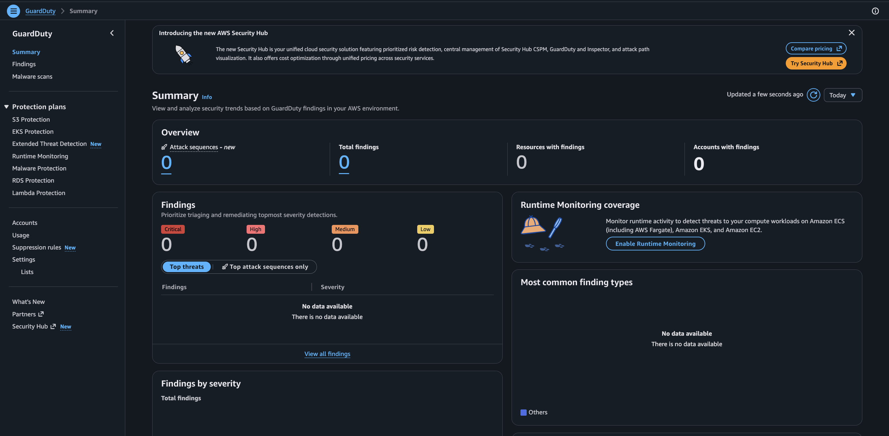 

### Security Hub Enabled
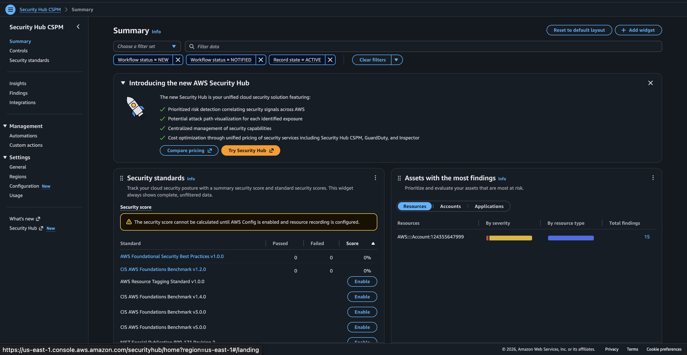 

### Automated Response Pipelines

Two EventBridge → Lambda remediation pipelines detect and respond to security events in real time:

#### IAM Privilege Escalation Detection

Detects `AttachRolePolicy` calls that attach `AdministratorAccess` and automatically revokes the policy.

```
CloudTrail → EventBridge (AttachRolePolicy + AdministratorAccess) → Lambda → iam:DetachRolePolicy
```

**Evidence:**

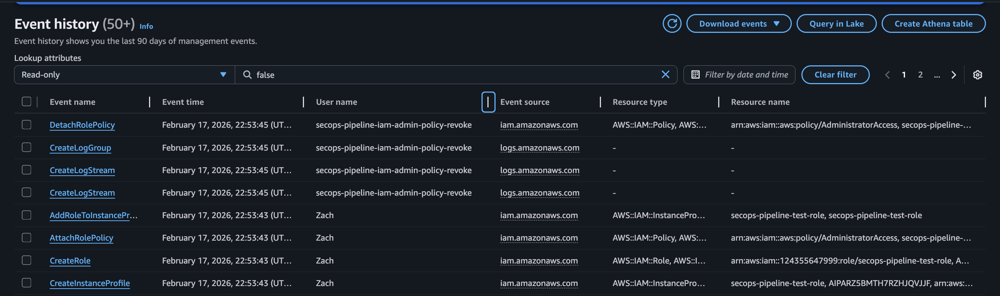 
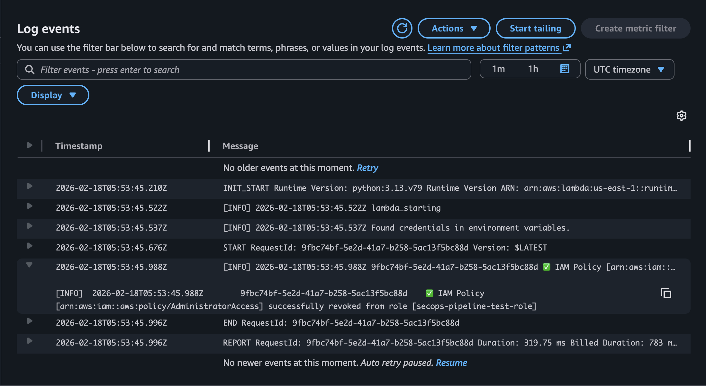 
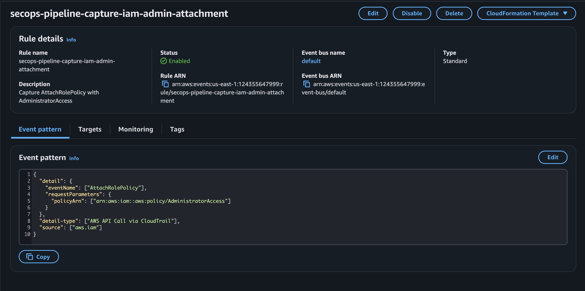 
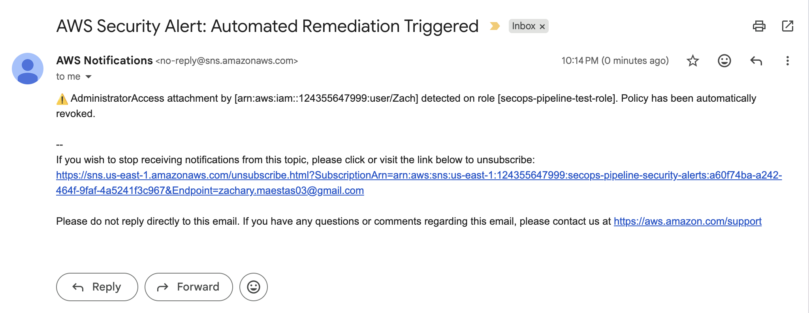 

#### Dangerous Security Group Ingress Detection

Detects `AuthorizeSecurityGroupIngress` calls that open dangerous ports (SSH/22, RDP/3389) to the internet (`0.0.0.0/0` or `::/0`) and automatically revokes only the offending rules.

```
CloudTrail → EventBridge (AuthorizeSecurityGroupIngress) → Lambda → ec2:RevokeSecurityGroupIngress
```

**Design decisions:**
- EventBridge triggers on all ingress changes; Lambda filters for dangerous port/CIDR combinations — necessary because EventBridge can't match deeply nested `requestParameters`
- Only the dangerous rule is revoked, not the entire security group — minimizes blast radius to avoid breaking attached resources
- Port detection uses range checking (`fromPort <= port <= toPort`) to catch rules like `0-65535` that include dangerous ports

**Evidence:**

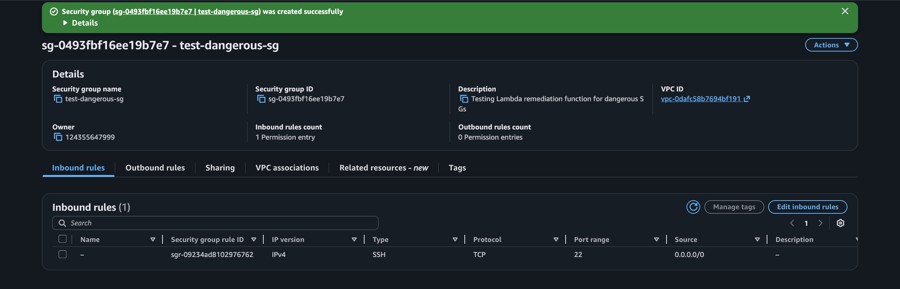 
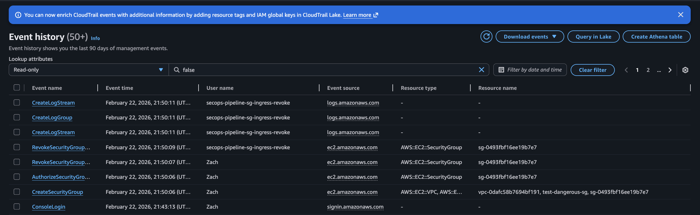
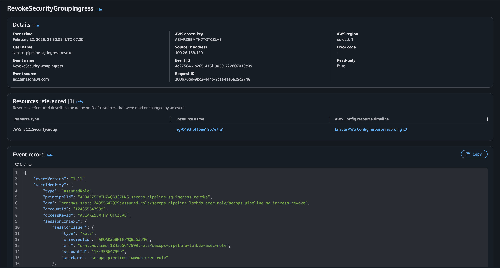 
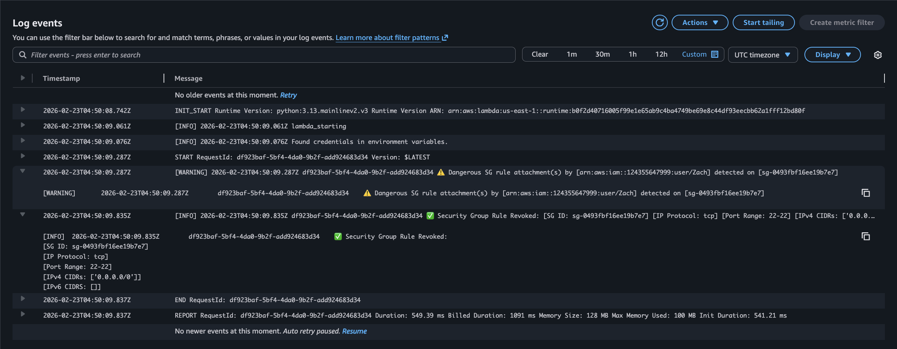 
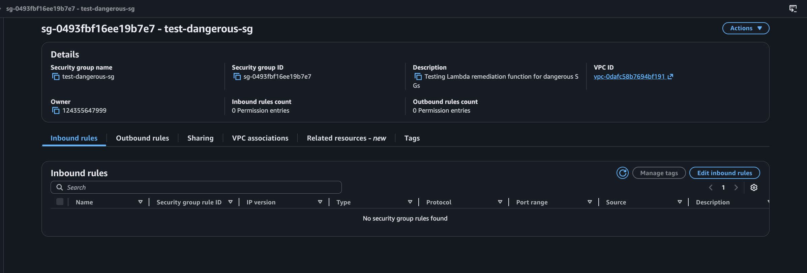 
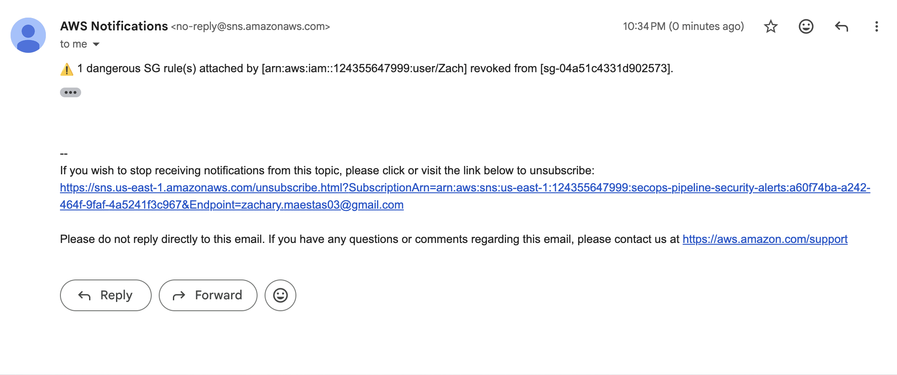 

### Lambda IAM Permissions

| Statement | Actions | Resource Scope |
|-----------|---------|---------------|
| AllowIAMRemediation | `iam:DetachRolePolicy` | Project-prefixed roles only |
| AllowSGDescribe | `ec2:DescribeSecurityGroups` | `*` (required — Describe doesn't support resource-level ARNs) |
| AllowSGRemediation | `ec2:RevokeSecurityGroupIngress` | All security groups in account/region |
| AllowCloudWatchLogs | `logs:CreateLogGroup`, `CreateLogStream`, `PutLogEvents` | Project-prefixed Lambda log groups |

---

## What This Architecture Does NOT Include (Yet)

These are planned for future phases and documented here for transparency:

| Gap | Planned Phase | Notes |
|-----|--------------|-------|
| Container image scanning | Phase 3 | No vulnerability scanning on images |
| IaC scanning (tfsec/checkov) | Phase 3 | No static analysis on Terraform |
| Secret detection in code | Phase 3 | No pre-commit or CI secret scanning |
| Trust policy change detection | Future | Alert on `UpdateAssumeRolePolicy` for unexpected trust modifications |
| Encryption at rest (RDS/KMS) | Future | RDS uses default encryption, not CMK |
| WAF on ALB | Future | No web application firewall layer |
| VPC Flow Logs | Future | No network traffic logging |

---

## Security Trade-offs

- **Single Lambda execution role** — both Lambdas share one role with IAM + EC2 + logging permissions. The SG Lambda has `iam:DetachRolePolicy` it doesn't need, and vice versa. Simpler to manage, but violates strict least privilege. In production, separate roles per function. 
- **Broad EventBridge trigger for SG** — fires on every ingress change, not just dangerous ones. Necessary due to EventBridge limitations, negligible cost.  
- **`security-group/*`** resource scope — Lambda can revoke rules on any SG in the account. Can't prefix-scope SG IDs like IAM roles.           
- **`force_destroy = true`** on CloudTrail S3 bucket — audit logs are deleted on terraform destroy. Convenient for teardown, but production requires retention protection.  