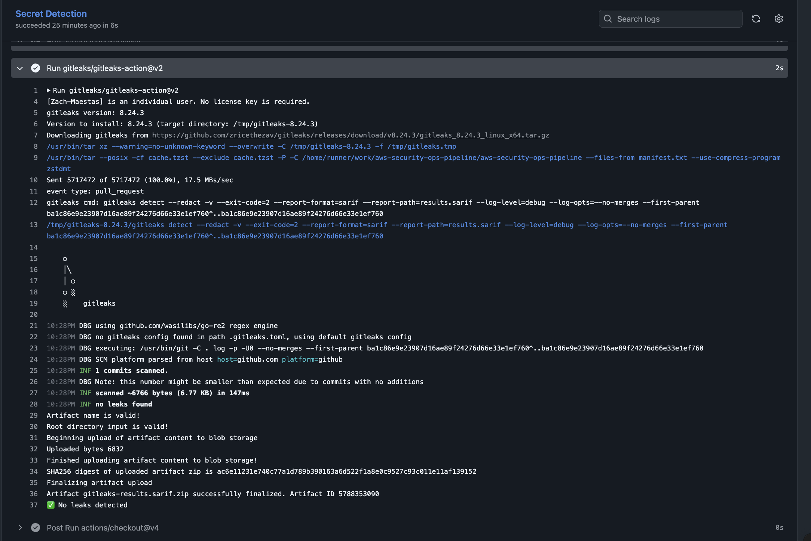
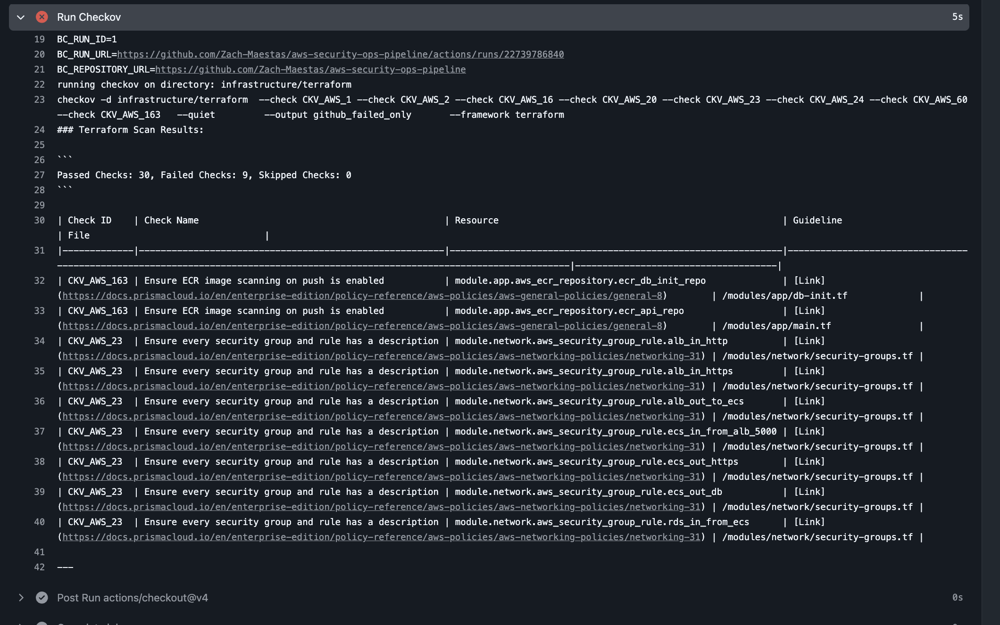
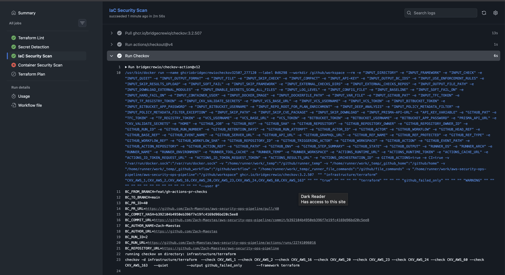
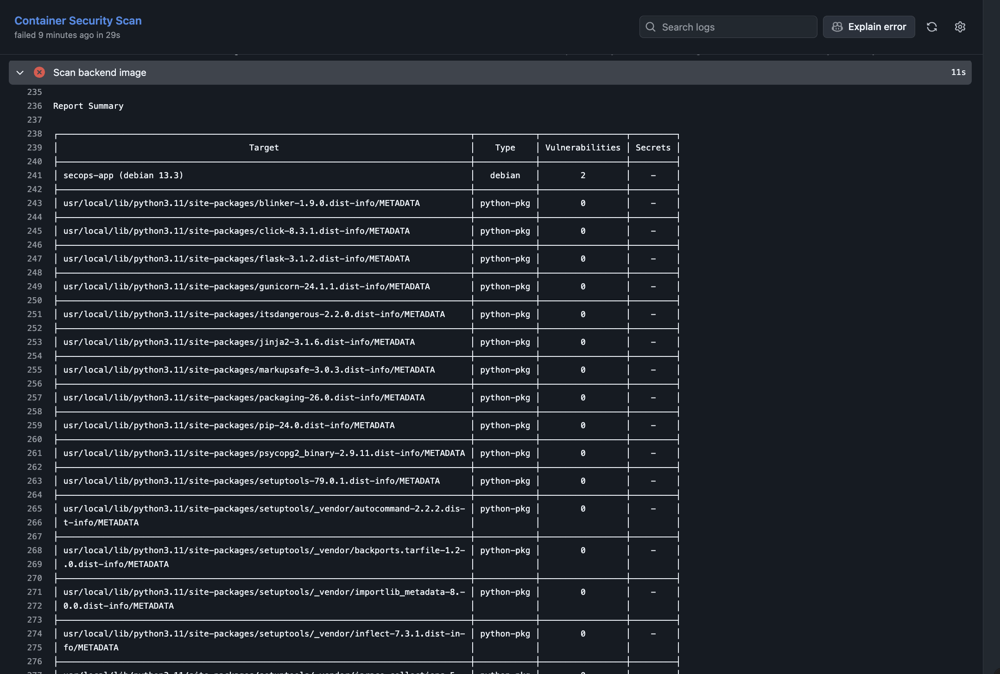
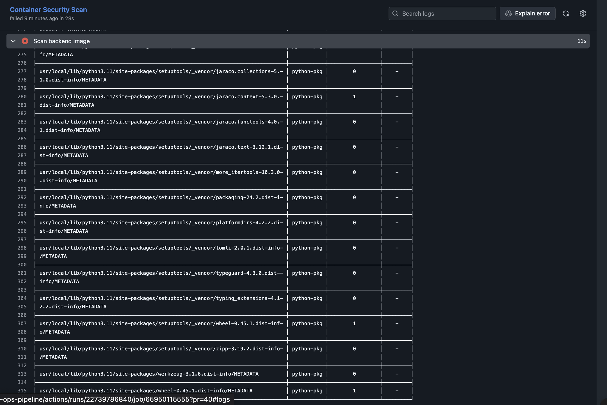
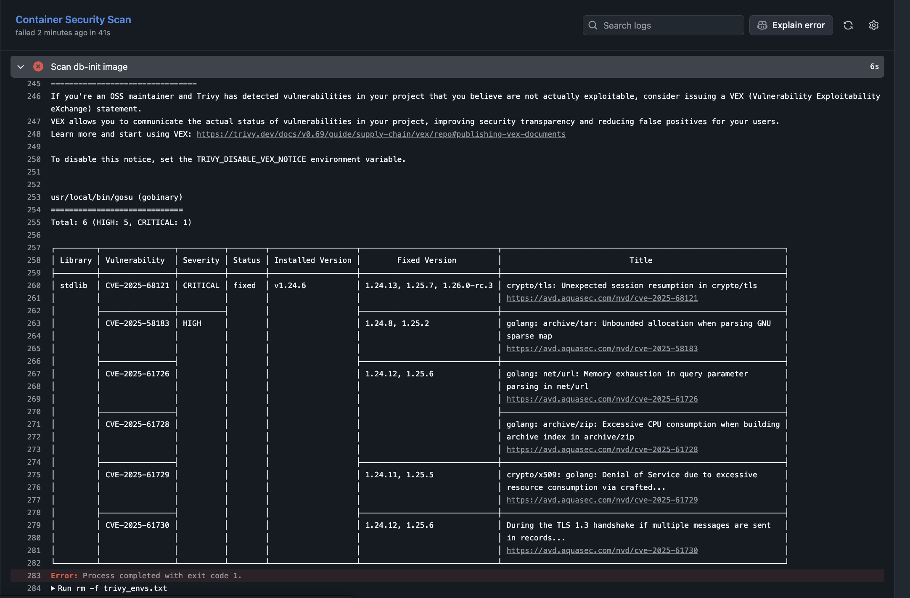
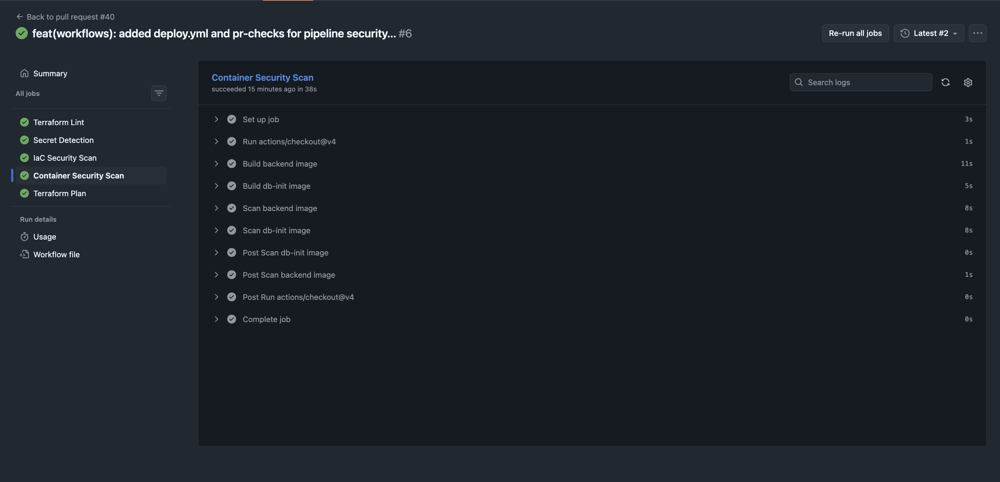
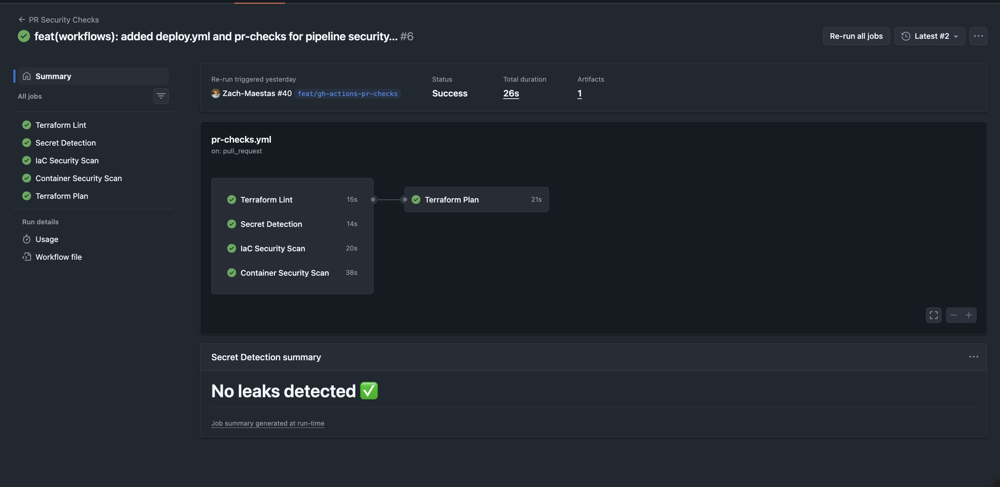
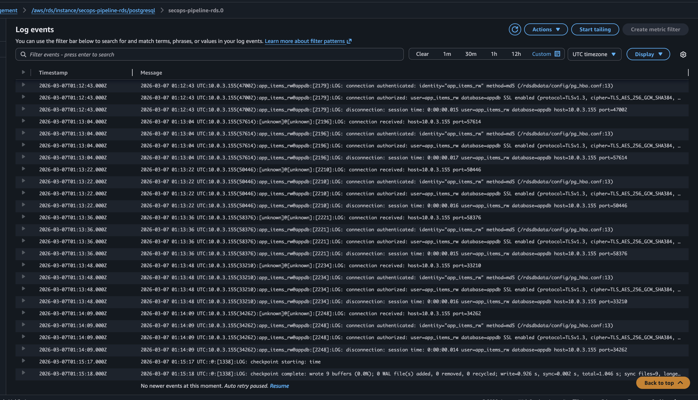
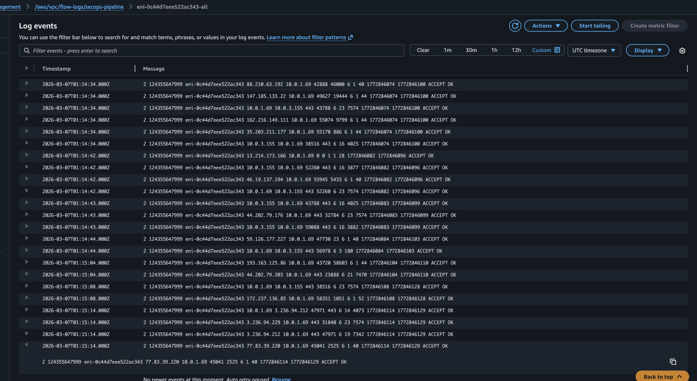

# Security Design 🛡️


This document details the security controls implemented in the AWS DevSecOps Security Operations project. For a summary, see the [README Security Controls Table](../README.md#security-controls).

---

## Network Security

### VPC Segmentation

The network uses a three-tier subnet architecture across two Availability Zones:

| Tier | Subnets | Contains | Internet Access |
|------|---------|----------|----------------|
| Public | `public-1`, `public-2` | ALB, NAT Gateways | Direct (IGW) |
| Private App | `private-app-1`, `private-app-2` | ECS Fargate tasks | Outbound only (NAT) |
| Private Data | `private-db-1`, `private-db-2` | RDS PostgreSQL | None |

### Security Groups

Security groups enforce layer-to-layer traffic flow:

```
Internet → [ALB SG: 443 inbound] → [ECS SG: app port from ALB SG only] → [RDS SG: 5432 from ECS SG only]
```

| Security Group | Inbound | Outbound |
|---------------|---------|----------|
| ALB | 443 from `0.0.0.0/0` | App port to ECS SG |
| ECS Tasks | App port from ALB SG | 5432 to RDS SG, 443 to internet (NAT) |
| RDS | 5432 from ECS SG | None required |

No security group allows `0.0.0.0/0` on any port other than the ALB's HTTPS listener.

### Routing

- **Internet Gateway** — attached to public subnets only.
- **NAT Gateway** — provides outbound internet for private app subnets (image pulls, API calls).
- **Private data subnets** — no route to the internet in either direction.

---

## Identity & Access Management

### ECS Execution Role

| Role | Purpose | Permissions |
|------|---------|-------------|
| Execution Role | ECS agent pulls images and injects secrets | ECR read, Secrets Manager read (specific ARNs only) |

### Least Privilege Approach

- No `*` resource wildcards on sensitive actions.
- Execution role can only read specific secrets, not all secrets in the account.

---

## Secrets Management

### How Credentials Flow

```
Secrets Manager → ECS Task Definition (valueFrom) → Container environment variable → Application
```

- DB credentials are stored in AWS Secrets Manager, not in Terraform variables, environment files, or code.
- The ECS task definition references secrets by ARN using `valueFrom` — credentials are injected at container startup.
- The execution role has permission to read only the specific secret ARNs needed.
- No secret values appear in Terraform state as plaintext resource attributes.

---

## Transport Security

- **ALB Listener** — HTTPS (443) with ACM-issued TLS certificate.
- **HTTP redirect** — port 80 redirects to 443.
- **ACM validation** — DNS validation via Route 53 (automated in Terraform).

---

## Container Security

- **Non-root user** — the Dockerfile sets a non-root `USER` for the application process.
- **Minimal base image** — Python slim variant, reducing attack surface.
- **No SSH** — Fargate tasks have no SSH daemon; debugging through CloudWatch logs.
- **Immutable deployments** — new code requires a new image push and service update.

---

## Detection & Incident Response (Phase 2)

### Monitoring Stack

| Service | Purpose |
|---------|---------|
| CloudTrail | API audit logging with S3 delivery and CloudWatch integration |
| GuardDuty | Automated threat detection with S3 protection |
| Security Hub | Centralized security findings dashboard |

### GuardDuty Enabled
 

### Security Hub Enabled
 

### Automated Response Pipelines

Two EventBridge → Lambda remediation pipelines detect and respond to security events in real time:

#### IAM Privilege Escalation Detection

Detects `AttachRolePolicy` calls that attach `AdministratorAccess` and automatically revokes the policy.

```
CloudTrail → EventBridge (AttachRolePolicy + AdministratorAccess) → Lambda → iam:DetachRolePolicy
```

**Evidence:**

 
 
 
 

#### Dangerous Security Group Ingress Detection

Detects `AuthorizeSecurityGroupIngress` calls that open dangerous ports (SSH/22, RDP/3389) to the internet (`0.0.0.0/0` or `::/0`) and automatically revokes only the offending rules.

```
CloudTrail → EventBridge (AuthorizeSecurityGroupIngress) → Lambda → ec2:RevokeSecurityGroupIngress
```

**Design decisions:**
- EventBridge triggers on all ingress changes; Lambda filters for dangerous port/CIDR combinations — necessary because EventBridge can't match deeply nested `requestParameters`
- Only the dangerous rule is revoked, not the entire security group — minimizes blast radius to avoid breaking attached resources
- Port detection uses range checking (`fromPort <= port <= toPort`) to catch rules like `0-65535` that include dangerous ports

**Evidence:**

 

 
 
 
 

### Lambda IAM Permissions

| Statement | Actions | Resource Scope |
|-----------|---------|---------------|
| AllowIAMRemediation | `iam:DetachRolePolicy` | Project-prefixed roles only |
| AllowSGDescribe | `ec2:DescribeSecurityGroups` | `*` (required — Describe doesn't support resource-level ARNs) |
| AllowSGRemediation | `ec2:RevokeSecurityGroupIngress` | All security groups in account/region |
| AllowCloudWatchLogs | `logs:CreateLogGroup`, `CreateLogStream`, `PutLogEvents` | Project-prefixed Lambda log groups |
| AllowPublishToOneTopic | `sns:Publish` | Project SNS security alerts topic only |

---

## DevSecOps Pipeline Security Gates (Phase 3)

### Pipeline Architecture

PR security checks run automatically on every pull request to `main`. All gates must pass before the Terraform Plan step executes.

```
PR opened → [Terraform Lint] → [Secret Detection] → [IaC Security Scan] → [Container Security Scan] → Terraform Plan
```

### OIDC Authentication

GitHub Actions authenticates to AWS using OpenID Connect — no stored AWS credentials.

```
GitHub Actions → OIDC token → AWS STS AssumeRoleWithWebIdentity → short-lived session credentials
```

The setup grants the ability for the GitHub Actions runner to authenticate to AWS via OIDC –  which involves GitHub issuing a signed OIDC ID token that proves the workflow's identity, and AWS STS exchanges that token for temporary IAM credentials. The IAM trust policy restricts role assumption to this specific repository. Also, the role granted to the GitHub Actions runner is least-privilege scoped, including a permissions boundary attached to prevent privilege escalation if one of the IAM roles were to be compromised. 

### Security Gates

#### Terraform Lint

Validates Terraform formatting (`fmt -check`) and configuration (`validate`) to catch syntax and structural issues before any security scanning.

#### Secret Detection (Gitleaks)

Scans full git history for leaked credentials — API keys, passwords, tokens.

**Evidence:**



#### IaC Security Scan (Checkov)

Static analysis on Terraform for security misconfigurations. Scoped to specific high-value checks:

| Check ID | What It Catches |
|----------|----------------|
| CKV_AWS_1 | IAM policies with full admin `*` privileges |
| CKV_AWS_2 | ALB not using HTTPS |
| CKV_AWS_16 | RDS not encrypted at rest |
| CKV_AWS_20 | S3 bucket with public READ ACL |
| CKV_AWS_23 | Security group rules without descriptions |
| CKV_AWS_24 | Security group allowing `0.0.0.0/0` to port 22 |
| CKV_AWS_60 | IAM role assumable by overly broad principals |
| CKV_AWS_163 | ECR image scanning on push not enabled |

**Evidence:**




#### Container Security Scan (Trivy)

Builds Docker images and scans for known CVEs at `CRITICAL` and `HIGH` severity. Unfixed vulnerabilities are excluded (`ignore-unfixed`) to avoid blocking on upstream patches not yet available.

**Evidence:**






### Vulnerability Remediation Lifecycle

**Checkov — Misconfigurations**

Checkov detected that Security Group rules didn't have descriptions (`CKV_AWS_23`) and that ECR image scanning on push wasn't enabled (`CKV_AWS_163`). Both were easy fixes in Terraform.

**Trivy — Base Image CVEs**

Trivy flagged CVEs in the `python:3.11-slim` base image in the Flask app. The image was upgraded to `python:3.13-slim` with `--upgrade pip setuptools wheel` added to the Dockerfile. It also detected CVEs in the `postgres:16-alpine` base, and upgrading to `postgres:17-alpine` resolved those.

**Trivy — Upstream Unfixed (Accepted Risk)**

After upgrading, Trivy still found CVEs in the Postgres image. The `gosu` binary was compiled with an outdated Go version. These are **upstream unfixed** — they can't be patched until the maintainers rebuild with a newer Go release. These CVEs are accepted via `.trivyignore` because the db-init container runs in a private subnet with no internet-facing exposure.

### Terraform Plan

Runs only after all security gates pass. Uses OIDC credentials to execute `terraform plan` against live state, surfacing infrastructure drift and validating changes.

### All Gates Passing



---

## Logging & Observability

### RDS PostgreSQL Logging

A custom parameter group enables database-level audit logging exported to CloudWatch:

| Parameter | Value | Purpose |
|-----------|-------|---------|
| `log_connections` | `1` | Track who connects to the database |
| `log_disconnections` | `1` | Track session duration for anomaly detection |
| `log_statement` | `ddl` | Log schema changes (CREATE, ALTER, DROP) — detects structural tampering |

**Evidence:**



### VPC Flow Logs

All network traffic in the VPC is logged to CloudWatch, capturing ACCEPT and REJECT records across all network interfaces. Flow logs are delivered via a dedicated IAM role scoped to the project's log group.

**Evidence:**



---

## What This Architecture Does NOT Include (Yet)

| Gap | Phase | Notes |
|-----|-------|-------|
| Trust policy change detection | Future | Alert on `UpdateAssumeRolePolicy` for unexpected trust modifications |
| Encryption at rest (RDS/KMS) | Future | RDS uses default encryption, not CMK |
| WAF on ALB | Future | No web application firewall layer |
| SAST | Future | No static application security testing |

---

## Security Trade-offs

- **Single Lambda execution role** — both Lambdas share one role with IAM + EC2 + logging permissions. The SG Lambda has `iam:DetachRolePolicy` it doesn't need, and vice versa. Simpler to manage, but violates strict least privilege. In production, separate roles per function. 
- **Broad EventBridge trigger for SG** — fires on every ingress change, not just dangerous ones. Necessary due to EventBridge limitations, negligible cost.  
- **`security-group/*`** resource scope — Lambda can revoke rules on any SG in the account. Can't prefix-scope SG IDs like IAM roles.           
- **Deploy role uses action wildcards** — `cloudtrail:*`, `lambda:*`, `s3:*` on the deploy role instead of exact actions. Necessary to stay under the 6,144-character AWS managed policy size limit. The permissions boundary caps effective permissions, but production would split into more granular policies or use inline policies.
- **`force_destroy = true`** on CloudTrail S3 bucket — audit logs are deleted on terraform destroy. Convenient for teardown, but production requires retention protection.  
- **`.trivyignore` for gosu CVEs** — Trivy flagged CVEs in the `gosu` binary compiled with an outdated Go version. It's used internally by the image's entrypoint to step down from root to the postgres user — upstream maintainers install it. Fixing it would require rebuilding the entire postgres base image with a newer Go compiler, which means maintaining a separate fork of the official image. Accepted risk: the db-init container runs in a private subnet with no internet-facing exposure.